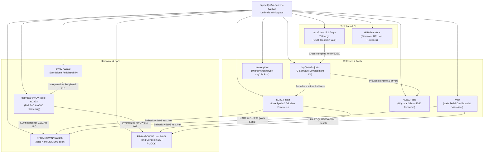

# TinyQV Sky25a Berzerk – RV2A03 Integration Workspace

[](https://github.com/fjpolo/tinyqv-tty25a-berzerk-rv2a03/actions/workflows/ci.yml)
[](LICENSE)
[](https://app.tinytapeout.com/shuttles/ttsky25a)
[](#6-hardware-emulation-on-fpga-sipeed-tang-nano-20k)
[](#8-interactive-web-serial-dashboard-browser-gui)

Welcome to the multi-repository workspace for the **RV2A03** (Nintendo NES NTSC Ricoh 2A03 APU audio peripheral) integrated into the **TinyQV** RISC-V System-on-Chip (SoC) for the [Tiny Tapeout Sky25a shuttle](https://app.tinytapeout.com/shuttles/ttsky25a) ("Berzerk" instance).

This repository serves as an umbrella superproject coordinating the hardware peripheral IP, the full SoC ASIC integration, the C software development kit (SDK), the dual FPGA/ASIC firmware projects, the interactive Web Serial GUI dashboard, and the pre-built RISC-V toolchain.

> [!TIP]
> Looking for architecture deep-dives and hardware manuals? Explore the [Technical Documentation Library](docs/README.md).  
> Looking for quick commands, build scripts, and syntax examples? See the [Project Cheatsheet](CHEATSHEET.md).

---

## Workspace Architecture

The workspace is organized into modular Git submodules and bundled toolchain artifacts:



---

## Submodule & Component Distribution

| Component | Path | Upstream / Fork URL | Configured Branch | Purpose |
| :--- | :--- | :--- | :--- | :--- |
| **Full SoC Integration** | [`ttsky25a-tinyQV-fjpolo-rv2a03`](ttsky25a-tinyQV-fjpolo-rv2a03/) | [`fjpolo/ttsky25a-tinyQV-fjpolo-rv2a03`](https://github.com/fjpolo/ttsky25a-tinyQV-fjpolo-rv2a03) | `fjpolo/RV2A03` | Top-level TinyQV SoC ("Berzerk" instance) integrating the RISC-V processor, interconnect, memory bus, and all peripherals including RV2A03 (`tqvp_fjpolo_rv2a03`). Used for full-chip tapeout hardening (OpenLane) and system-level verification. |
| **RV2A03 Peripheral IP** | [`tinyqv-rv2a03`](tinyqv-rv2a03/) | [`fjpolo/tinyqv-rv2a03`](https://github.com/fjpolo/tinyqv-rv2a03) | `main` | Standalone hardware repository for the RV2A03 audio peripheral (based on `tinyqv-full-peripheral-template`). Contains synthesizable Verilog (`apu.v`), SPI interface, unit-level cocotb testbench, and register definitions. |
| **FPGA Target (Console 60K)** | [`FPGA/GOWIN/console60k`](FPGA/GOWIN/console60k/) | Local Workspace | `master` | Self-contained Gowin EDA FPGA implementation targeting the **Sipeed Tang Console 60K** (Gowin GW5AT-60B). Features real-time Delta-Sigma audio output driving a **MUSE PMOD-AUDIO v1.2** loudspeaker, an 8-LED status bar (**PMOD-LEDx8**), onboard I2S audio, and 115200 baud UART. |
| **FPGA Target (Nano 20K)** | [`FPGA/GOWIN/nano20k`](FPGA/GOWIN/nano20k/) | Local Workspace | `master` | Self-contained Gowin EDA FPGA implementation targeting the **Sipeed Tang Nano 20K** (Gowin GW2AR-18C). Features real-time 16-bit 46.875 kHz I2S audio via the onboard MAX98357A amplifier, autonomous BRAM boot, and 115200 baud UART logging. |
| **FPGA Firmware Project** | [`tinyQV-projects/rv2a03_fpga`](tinyQV-projects/rv2a03_fpga/) | Local Workspace | - | Interactive Live Synthesizer, Retro Soundboard (Coin, Jump, Laser, Explosion, 1-Up, Snare, Barrel Drum with 4 distortion modes), Chiptune Jukebox (*BlasNESmous Theme*, *Berzerk*, *Zelda*), and 5/5 self-test suite calibrated for 27 MHz FPGA clock. |
| **ASIC Silicon Firmware Project** | [`tinyQV-projects/rv2a03_asic`](tinyQV-projects/rv2a03_asic/) | Local Workspace | - | Pre-configured firmware tailored for physical silicon on the **Tiny Tapeout Sky25a Demo Board / EVK** (64 MHz system clock, GPIO pin muxing via `FUNC_SEL`, and QSPI XIP flash). |
| **Web Serial Dashboard** | [`web/`](web/) | Local Workspace | - | Zero-install, browser-based Web Serial GUI & Synthesizer with **FamiCom Red** piano keys, retro arcade soundboard pads, real-time oscilloscope, and bi-directional UART telemetry. |
| **TinyQV C SDK** | [`tinyQV-sdk-fjpolo`](tinyQV-sdk-fjpolo/) | [`fjpolo/tinyQV-sdk-fjpolo`](https://github.com/fjpolo/tinyQV-sdk-fjpolo) | `main` | C SDK fork for writing firmware and bare-metal applications targeting TinyQV. Contains startup assembly (`start.s`), linker scripts, runtime libraries, and peripheral drivers (UART, SPI, Timer, GPIO, Gamepad, PRISM, VGA, RV2A03). |
| **Demo Projects** | [`tinyQV-projects`](tinyQV-projects/) | [`fjpolo/tinyQV-projects`](https://github.com/fjpolo/tinyQV-projects) | `dev/20290907` | Curated collection of standalone demo applications and firmware examples for TinyQV (3D ASCII donut, VGA graphics, LCD, cellular automata, UART echo). |
| **MicroPython Port** | [`micropython`](micropython/) | [`MichaelBell/micropython`](https://github.com/MichaelBell/micropython) | `tinyqv-sky25a` | Minimal MicroPython runtime ported for TinyQV on the Sky25a shuttle. Provides an interactive Python REPL over UART (115200 baud) and hardware access via `machine.Pin` and SPI. |
| **GNU Toolchain (v2.0)** | [`riscv32ec-15.1.0-tqv-2.0.tar.gz`](https://github.com/MichaelBell/riscv-gnu-toolchain/releases/tag/15.1.0-tqv-2.0) | [Upstream Release](https://github.com/MichaelBell/riscv-gnu-toolchain/releases/tag/15.1.0-tqv-2.0) | `15.1.0-tqv-2.0` | Pre-built custom RISC-V GNU GCC toolchain (`riscv32ec-15.1.0-tqv-2.0`) configured for GCC 15 with `rv32ec_zcb_zicond` / `ilp32e` required for TinyQV on the Sky25a shuttle. |

---

## Getting Started

### 1. Cloning the Repository

Because this repository uses submodules (including nested submodules inside `tinyqv-rv2a03/firmware`), always clone recursively:

```bash
git clone --recurse-submodules https://github.com/fjpolo/tinyqv-tty25a-berzerk-rv2a03.git
cd tinyqv-tty25a-berzerk-rv2a03
```

If you have already cloned the repository without submodules:

```bash
git submodule update --init --recursive
```

---

### 2. Setting Up the RISC-V Toolchain

For the **Tiny Tapeout Sky25a shuttle (`ttsky25a`)**, TinyQV uses the **v2.0 toolchain** (`riscv32ec-15.1.0-tqv-2.0`), which upgrades the toolchain to GCC 15 configured for `rv32ec_zcb_zicond` with `ilp32e` ABI.

#### Download and Extract the v2.0 Toolchain (`15.1.0-tqv-2.0`)

**Option A: Extract to the default location (`/opt/tinyQV`) (Recommended)**
```bash
# 1. Download the pre-built v2.0 toolchain (x86_64 Linux):
wget https://github.com/MichaelBell/riscv-gnu-toolchain/releases/download/15.1.0-tqv-2.0/riscv32ec-15.1.0-tqv-2.0.tar.gz
# (If on ARM64 Linux / Apple Silicon WSL, use: riscv32ec-arm64-15.1.0-tqv-2.0.tar.gz)

# 2. Extract to /opt/tinyQV (clearing any older version first):
sudo mkdir -p /opt/tinyQV
sudo rm -rf /opt/tinyQV/*
sudo tar -xzf riscv32ec-15.1.0-tqv-2.0.tar.gz -C /opt/tinyQV --strip-components=1
```

**Option B: Extract to a local directory without sudo**
```bash
mkdir -p $HOME/toolchains/tinyQV
tar -xzf riscv32ec-15.1.0-tqv-2.0.tar.gz -C $HOME/toolchains/tinyQV --strip-components=1
```

#### Make Toolchain Available at Startup (Persistent PATH)

To ensure the compiler binaries are automatically accessible in every new terminal session without re-exporting manually:

- **For Bash users (`~/.bashrc`)**:
  ```bash
  echo 'export PATH=/opt/tinyQV/bin:$PATH' >> ~/.bashrc
  source ~/.bashrc
  ```

- **For Zsh users (`~/.zshrc`)**:
  ```bash
  echo 'export PATH=/opt/tinyQV/bin:$PATH' >> ~/.zshrc
  source ~/.zshrc
  ```

- **System-wide for all users (`/etc/profile.d/tinyqv.sh`)**:
  ```bash
  echo 'export PATH=/opt/tinyQV/bin:$PATH' | sudo tee /etc/profile.d/tinyqv.sh
  ```

*(Note: If you extracted to a custom local directory using Option B, adjust the path to `$HOME/toolchains/tinyQV/bin` and also persist `export RISCV_TOOLCHAIN=$HOME/toolchains/tinyQV`).*

#### Verify Installation

Verify that the toolchain is installed and accessible in your `PATH`:
```bash
riscv32-unknown-elf-gcc --version
```

---

## Submodule Usage & Workflows

### 1. Standalone RV2A03 Peripheral (`tinyqv-rv2a03`)

Use this repository to develop, modify, and verify the RV2A03 audio core in isolation.

#### Hardware Features
- **Audio Channels**: Pulse 1, Pulse 2, Triangle, and Noise channels.
- **Mixer**: Linearized output mixer producing 16-bit audio samples.
- **Modifications**: Frequency sweep unit omitted to conserve area; NTSC-tuned timings.
- **Peripheral ID**: **#15** (Index `14`).

#### Register Map Summary
| Address | Name | Access | Description |
| :--- | :--- | :--- | :--- |
| `0x00` - `0x1F` | APU Registers | R/W | Direct access to NES APU sound channels (maps to NES `0x4000` - `0x401F`). |
| `0x20` | Configuration0 | R/W | `b2`: `isMMC5` (MMC5 expansion), `b1`: `US` (ultrasound mode), `b0`: `CE` (clock enable). |
| `0x22` | Status0 | R | `b1`: APU interrupt request, `b0`: sample ready. |
| `0x23` | Data Input | R/W | Command/data write port to APU. |
| `0x24` | Data Output MSB | R | Most significant byte of the 16-bit mixed audio sample. |
| `0x25` | Data Output LSB | R | Least significant byte of the 16-bit mixed audio sample. |

#### Running Standalone Simulation (cocotb)

Run simulation inside a Python virtual environment to isolate test dependencies:

```bash
cd tinyqv-rv2a03/test
sudo apt update
sudo apt install -y iverilog gtkwave
sudo apt install -y python3-venv iverilog gtkwave
python3 -m venv .venv
source .venv/bin/activate
pip install -r requirements.txt
make -B
```

Inspect generated waveforms using GTKWave or Surfer:
```bash
gtkwave tb.vcd tb.gtkw
```

---

### 2. Firmware & Application Development (`tinyQV-sdk-fjpolo`)

The SDK provides the libraries and linker scripts to write C code for TinyQV.

#### Project Templates
- `example-project/`: Standard template for programs running on hardware with external QSPI flash.
- `example-sim-project/`: Compact template tailored for simulation runs with constrained RAM/flash.

#### Building the SDK & Applications

1. **Build the SDK runtime libraries**:
   ```bash
   cd tinyQV-sdk-fjpolo
   make
   ```
   This builds `start.o`, `tinyQV.a`, `tinyQV-sim.a`, `tinyQV-asteroids.a`, and `tinyQV-berzerk.a` (which includes the `rv2a03.o` driver).

2. **RV2A03 NES Audio Driver (`peripherals/rv2a03.h`)**:
   The SDK includes a modular C driver for the RV2A03 APU at peripheral index #14 (`0x8000380`):
   - `rv2a03_regs.h`: Register memory map (`RV2A03_SQ1_VOL`, `RV2A03_TRI_LINEAR`, `RV2A03_SND_CHN`, etc.).
   - `rv2a03_init()`: Configures peripheral enable, clock divider, and clears sound channels.
   - `rv2a03_play_square()`, `rv2a03_play_triangle()`, `rv2a03_play_noise()`: High-level channel note playback.
   - `rv2a03_read_sample()`: Reads 16-bit mixed audio sample from hardware ports (`0x24` / `0x25`).

3. **Build an Application**:
   ```bash
   cd example-project
   make
   ```
   *(Or `cd example-sim-project && make` for simulation firmware).*

This generates `.elf`, `.bin`, and `.hex` binaries compatible with TinyQV and the [TinyQV Web Programmer](https://program.tinyqv.com).

---

### 3. Full SoC ASIC Integration (`ttsky25a-tinyQV-fjpolo-rv2a03`)

This submodule integrates the complete SoC design for the Tiny Tapeout Sky25a shuttle.

#### Key Files
- `src/peripherals.v`: Peripheral interconnect wiring, instantiating `tqvp_fjpolo_rv2a03` at peripheral index 14/15.
- `src/user_peripherals/RV2A03/`: Verilog sources for the RV2A03 peripheral within the SoC tree.
- `docs/user_peripherals/15_RV2A03.md`: Integration datasheet for the shuttle submission.

#### Running Full SoC cocotb Simulation

Run simulation inside a Python virtual environment:

```bash
cd ttsky25a-tinyQV-fjpolo-rv2a03/test
python3 -m venv .venv
source .venv/bin/activate
pip install -r requirements.txt
make -B
```

#### ASIC Hardening via OpenLane
To run the automated synthesis and physical layout flow:
```bash
cd ttsky25a-tinyQV-fjpolo-rv2a03
./run_flow.sh
```

---

### 4. Firmware Projects & Showcase (`tinyQV-projects`)

The repository provides production-grade firmware projects targeting both physical silicon and FPGA emulation:

#### Dual Firmware Targets
* **`rv2a03_fpga/` (FPGA Emulation Firmware)**:
  - Calibrated for the **27.000 MHz** FPGA system clock.
  - Interactive live UART synthesizer (115200 8N1) with **QWERTZ & QWERTY** chromatic keyboard (`A..K`, `W,E,T,Z/Y,U,O,P`).
  - **Retro NES Soundboard**: Instant SFX for *Coin*, *Jump*, *Laser*, *Explosion*, *1-Up*, *Snare*, and *Barrel Drum*.
  - **Barrel Drum Distortion Engine**: 4 selectable overdrive modes: Clean Acoustic, Warm Saturation, Metallic Fuzz, and Industrial Doom.
  - **Chiptune Jukebox**: Polyphonic playback of *BlasNESmous Theme* (Carlos Viola / @fjpolo), *Berzerk APU Theme*, and *Zelda Secret Fanfare*.
  - Autonomous 32 KB Block RAM boot with direct Delta-Sigma and I2S DAC taps.

* **`rv2a03_asic/` (Physical Silicon EVK Firmware)**:
  - Calibrated for the **64.000 MHz** Tiny Tapeout Sky25a Demo Board system clock.
  - Automatically configures peripheral output pin multiplexing via `FUNC_SEL` and `AUDIO_FUNC_SEL` (`uo_out[0]` for audio PWM DAC, `uo_out[1]` for `apu_IRQ`, `uo_out[2]` for `apu_o_ce`).
  - Linked for external QSPI XIP Flash execution with full PSRAM cache support.

* **`rv2a03_test/` (Hardware Verification Test Suite)**:
  - 5/5 automated hardware verification self-tests translating the cocotb test suite into bare-metal C.

#### Other SDK Demos
- `donut/`: Animated ASCII 3D donut rendered over UART.
- `vga_gfx/` & `vga_console/`: Hardware-accelerated graphics and text console demos using the PRISM/VGA peripheral.
- `cellular/`: Conway's Game of Life cellular automaton.
- `ledstrip/`: WS2812B NeoPixel LED strip controller.
- `hello/`: Minimal UART "Hello, World!" example.

#### Automated Multi-Target Firmware Compilation
A top-level build script is provided to compile either or all targets, enforce the 32 KB BRAM ceiling, and automatically synchronize the generated hex file to both Tang Console 60K and Tang Nano 20K FPGA directories:

```powershell
# 1. Compile both FPGA and ASIC firmware targets:
.\build_firmware.bat -Target all

# 2. Compile FPGA firmware only and update FPGA BRAM hex:
.\build_firmware.bat -Target fpga

# 3. Compile ASIC firmware only (for TT Sky25a EVK):
.\build_firmware.bat -Target asic

# 4. Clean and rebuild all targets from scratch:
.\build_firmware.bat -Clean

# 5. End-to-end: compile firmware, update hex, rebuild bitstream, and flash Tang Console 60K:
.\build_firmware.bat -RebuildFpga console60k -Flash sram
```

For Linux / WSL environments:
```bash
# Build all targets
./build_firmware.sh --target all --clean

# Build ASIC target only
./build_firmware.sh --target asic
```

#### Manual Project Compilation
Make sure the SDK runtime libraries are compiled first (`make` in `tinyQV-sdk-fjpolo`), then build:

```bash
cd tinyQV-projects/rv2a03_fpga
make
```

Or for `donut`:
```bash
cd tinyQV-projects/donut
make TINYQV_SDK=../../tinyQV-sdk-fjpolo
```

This generates `.elf`, `.bin`, and `.hex` binaries ready to upload with the [TinyQV Web Programmer](https://program.tinyqv.com).

---

### 5. MicroPython Runtime Port (`micropython`)

The `micropython` submodule contains a customized MicroPython port targeting TinyQV on Sky25a, providing an interactive Python REPL over UART and hardware control through the `machine` module.

#### Building MicroPython

1. **Build the host cross-compiler (`mpy-cross`)**:
   ```bash
   cd micropython
   make -C mpy-cross
   ```

2. **Build the TinyQV port firmware**:
   ```bash
   cd ports/tinyQV
   make submodules
   make TINYQV_SDK=../../../tinyQV-sdk-fjpolo
   ```

This generates `build/firmware.bin` suitable for flashing to external QSPI memory. When TinyQV boots with this firmware, connect to UART at **115200 baud** to access the MicroPython prompt (`>>>`):

```python
import machine
# Control GPIO pins (outputs 0-7, inputs 8-15)
pin = machine.Pin(1, machine.Pin.OUT)
pin.value(1)
```

---

### 6. Hardware Emulation on FPGA (Sipeed Tang Nano 20K)

The repository includes a complete, hardware-tested FPGA emulation target located in [`FPGA/GOWIN/nano20k/`](FPGA/GOWIN/nano20k/). It implements the entire TinyQV SoC with the RV2A03 APU on a **Gowin GW2AR-18C** FPGA.

#### Hardware Features
- **27 MHz RISC-V SoC**: Boots autonomously from 32 KB on-chip Block RAM pre-loaded with firmware (`rv2a03_test.hex`).
- **Real-Time I2S Audio**: Drives the onboard **MAX98357A** Class-D audio amplifier with 16-bit 46.875 kHz stereo PCM audio.
- **Diagnostic LEDs**: 6 active-low LEDs for dual-speed heartbeat, reset status, UART TX activity, APU audio playback, and power amp enable.
- **Serial Telemetry**: Streams boot messages, test pass/fail results, and chiptune song playback over UART at **115,200 baud 8N1** via the onboard BL616 MCU USB-Serial bridge (`COM17`).

#### Automated Build & Flash Flow
Run directly from the root workspace:

```powershell
# 1. Full synthesis, place & route, and bitstream generation:
.\build_gowin.bat

# 2. Flash bitstream directly to Tang Nano 20K persistent external SPI Flash (exFlash):
.\build_gowin.bat -FlashMode flash -Flash

# 3. Flash existing bitstream without waiting for synthesis:
.\build_gowin.bat -FlashMode flash -Flash -NoBuild
```

#### Real-Time Serial Monitoring in VS Code
To stream firmware output directly inside VS Code:

1. **Option A: PowerShell Tool**:
   ```powershell
   .\serial_monitor.ps1
   ```
2. **Option B: VS Code Task**:
   Press `Ctrl+Shift+P` $\rightarrow$ **`Tasks: Run Task`** $\rightarrow$ select **`Serial Monitor: Tang Nano 20K (115200)`**.
3. **Option C: One-Click Batch**:
   Double-click `.\serial_monitor.bat` or run it from any terminal.

Press the **S1** button on the board (near the HDMI port) to reset the SoC. You will see:
```text
=====================================================
  TinyQV RV2A03 NES APU Sound Peripheral Testsuite  
  Target: Sky25a Berzerk (Peripheral Index 14)      
=====================================================

[TEST 1] Testing Square Channel 1 (440 Hz)... PASS
[TEST 2] Testing Square Channel 2 (880 Hz)... PASS
[TEST 3] Testing Triangle Channel (440 Hz)... PASS
[TEST 4] Testing Noise Channel... PASS
[TEST 5] Testing All Channels Simultaneously... PASS

-----------------------------------------------------
Test Results: 5/5 tests passed successfully.
-----------------------------------------------------

  ============================================================
     TinyQV RV2A03 NES APU LIVE SYNTHESIZER & SOUNDBOARD      
        Target: Sky25a Berzerk | QWERTZ / QWERTY Ready        
  ============================================================

  PIANO KEYS:  White: [A..K] (C4..C5) | Black: [W,E,T,Z/Y,U,O,P]
  CONTROLS:    [1..4] Channels  [Q] Duty  [,/.] Octave  [-/+] Vol
  SOUNDBOARD:  [C] Coin  [B] Jump  [X] Explosion  [V] 1-Up  [L] Laser
  JUKEBOX:     [5] BlasNESmous  [6] Berzerk  [7] Zelda Fanfare
  ============================================================
```

---

### 7. Hardware Emulation on FPGA (Sipeed Tang Console 60K + PMODs)

The repository also includes a complete FPGA target for the **Sipeed Tang Console 60K** handheld/retro board located in [`FPGA/GOWIN/console60k/`](FPGA/GOWIN/console60k/). It targets the **Gowin Arora V GW5AT-60B** (`GW5AT-LV60PG484AC1/I0`) FPGA.

#### Hardware Features
- **PMOD Loudspeaker Output**: Plugs into the lower PMOD socket (**PMOD0**), driving a **MUSE PMOD-AUDIO v1.2** module featuring a **PAM8403** Class-D audio amplifier, volume potentiometer, attached oval loudspeaker (J2), and 3.5mm stereo headphone jack. Driven by a 1st-order 16-bit Delta-Sigma DAC operating at 27 MHz.
- **PMOD 8-LED Array**: Plugs into the upper PMOD socket (**PMOD1**), driving a **PMOD-LEDx8** module with 8 active-high status indicators for heartbeats, UART TX activity, reset state, audio playing indicator, and PLL lock.
- **Clock Synthesis**: Arora V PLLA synthesizes exactly 27.000 MHz from the onboard 50 MHz crystal, guaranteeing 100% pitch-matched NES APU audio and bit-perfect 115,200 baud UART with the pre-compiled firmware image.
- **Autonomous Boot**: Self-boots from on-chip Block RAM pre-loaded with `rv2a03_test.hex`.

#### Automated Build & Flash Flow
```powershell
# 1. Full compilation for Tang Console 60K:
.\build_console60k.bat
# (or: .\build_gowin.bat -Board console60k)

# 2. Flash bitstream directly to SRAM (volatile, fast):
.\build_console60k.bat -Flash sram

# 3. Flash bitstream to persistent onboard SPI Flash:
.\build_console60k.bat -Flash flash
```

---

### 8. Interactive Web Serial Dashboard (Browser GUI)

The workspace includes a modern, zero-install **Web Serial Dashboard & Visual Synthesizer** located in [`web/`](web/). It interfaces directly with the Tang Console 60K (`COM19`) and Tang Nano 20K (`COM17`) through the native browser Web Serial API.

#### Features
- **Visual Chromatic Piano**: 1.5-octave interactive keyboard with white and **FamiCom Red** sharp/flat keys, glowing active feedback, mouse/touch clicks, and physical QWERTZ / QWERTY keyboard bindings (`A..K`, `W,E,T,Z/Y,U,O,P`).
- **Retro Arcade Soundboard**: 8 visual pads triggering authentic NES SFX (*Coin*, *Barrel Drum* with 4 distortion modes, *Jump*, *Laser*, *Explosion*, *1-Up*, *Snare*, and *Distortion Cycle*).
- **Chiptune Jukebox**: One-click track controls for *BlasNESmous Theme* (Carlos Viola), *Berzerk APU Theme*, and *Zelda Secret Fanfare*.
- **Real-Time Oscilloscope**: HTML5 Canvas visualizer rendering simulated 2A03 channel waveforms (Pulse 1, Pulse 2, Triangle, Noise) and note frequencies.
- **Bi-Directional Telemetry**: Parses incoming hardware UART packets to automatically keep UI volume sliders, octave badges, and channel toggles synchronized with physical board button presses.

#### Keyboard Shortcut Matrix
| Key(s) | Action |
| :--- | :--- |
| **`A` .. `K`** | White keys (`C4` to `C5`) |
| **`W, E, T, Z/Y, U, O, P`** | **FamiCom Red** sharp/flat keys (`C#4, D#4, F#4, G#4, A#4, C#5, D#5`) |
| **`1` .. `4`** | Channel selection: Pulse 1, Pulse 2, Triangle, Noise |
| **`Q`** | Cycle Pulse Duty Cycle (`12.5%`, `25%`, `50%`, `75%`) |
| **`[` / `]`** or **`←` / `→`** | Octave Down / Up (range: 2 to 6) |
| **`-` / `+`** or **`↓` / `↑`** | Volume Down / Up (range: 0 to 15) |
| **`Space`** or **`M`** | Mute Audio / Stop playback |
| **`C`** | Play Mario Coin SFX |
| **`B`** | Play Barrel Drum hit |
| **`0` / `D`** | Cycle Barrel Distortion (0:Clean $\rightarrow$ 1:Warm $\rightarrow$ 2:Fuzz $\rightarrow$ 3:Doom) |
| **`5`, `6`, `7`** | Jukebox: BlasNESmous, Berzerk, Zelda Fanfare |
| **`R`** | Dump Hardware APU Registers |
| **`*`** | Run 5/5 Hardware Verification Self-Test |

#### Launching the Dashboard
Launch with a single click (starts a local server at `http://localhost:8080/web/` and opens your default browser):

```powershell
# Option A: One-click batch launcher
.\launch_dashboard.bat

# Option B: PowerShell launcher
.\launch_dashboard.ps1
```
*(Compatible with Google Chrome, Microsoft Edge, and Opera).*

---

### 9. Automated CI/CD Pipeline (GitHub Actions)

Continuous integration and automated delivery are implemented via GitHub Actions workflows in [`.github/workflows/`](.github/workflows/):

| Workflow | File | Triggers | Responsibilities |
| :--- | :--- | :--- | :--- |
| **CI** | [`.github/workflows/ci.yml`](.github/workflows/ci.yml) | `push` (master, main, dev/*, tags), `pull_request`, `workflow_dispatch` | • **Firmware Build**: Compiles `rv2a03_fpga`, `rv2a03_asic`, and `rv2a03_test`<br>• **Size Limit Check**: Enforces `< 32,768` bytes (32 KB BRAM ceiling)<br>• **BRAM Sync Verification**: Checks hex files for Console 60K & Nano 20K match compiled firmware<br>• **Hardware Simulation**: Runs 5/5 APU `cocotb` regression tests with Icarus Verilog<br>• **Verilog Linting**: Checks `peripheral.v` and `apu.v` syntax with `iverilog -g2012` |
| **Release** | [`.github/workflows/release.yml`](.github/workflows/release.yml) | `push` tags (`*`), `workflow_dispatch` | • Compiles production binaries<br>• Packages `.bin`, `.hex`, and `.zip` archives<br>• Publishes official GitHub Releases with auto-generated changelog |

---

### 10. Silicon Layout & Interactive 3D Visualizer

The RV2A03 audio peripheral is physically hardened on the **SkyWater 130nm (`sky130A`)** CMOS process for the [Tiny Tapeout Sky25a shuttle](https://app.tinytapeout.com/shuttles/ttsky25a).

#### 2D GDSII Silicon Layout
<p align="center">
  
</p>

#### Interactive 3D Silicon Explorer
Explore the full chip layout, standard cell placement, power distribution grids, and metal interconnect layers in 3D:
👉 **[Open Interactive 3D WebGL Viewer](https://fjpolo.github.io/tinyqv-rv2a03/)**

---

## Submodule Maintenance & Best Practices

### Updating Submodules to Remote Tracking Branches
To pull the latest commits for each submodule according to `.gitmodules`:
```bash
git submodule update --remote --merge
```

### Making Changes Inside a Submodule
Because submodules point to specific commit hashes (detached `HEAD` by default), follow this workflow when making modifications:

1. Navigate into the submodule directory:
   ```bash
   cd tinyqv-rv2a03
   ```
2. Checkout or create the appropriate working branch:
   ```bash
   git checkout main   # or your active dev branch
   ```
3. Commit and push changes to the submodule's remote:
   ```bash
   git commit -am "Update audio mixer"
   git push origin main
   ```
4. Return to the root repository and record the new submodule commit pointer:
   ```bash
   cd ..
   git add tinyqv-rv2a03
   git commit -m "Update tinyqv-rv2a03 submodule reference"
   git push origin master
   ```

---

## Useful References & Links

- [Tiny Tapeout Documentation](https://tinytapeout.com)
- [Tiny Tapeout Sky25a Shuttle](https://app.tinytapeout.com/shuttles/ttsky25a)
- [TinyQV Architecture (Michael Bell)](https://github.com/MichaelBell/tinyQV)
- [TinyQV Web Programmer](https://program.tinyqv.com)
- [NESdev Wiki: 2A03 APU](https://www.nesdev.org/wiki/APU)
- [Technical Documentation Library](docs/README.md)
- [Project Cheatsheet](CHEATSHEET.md)
