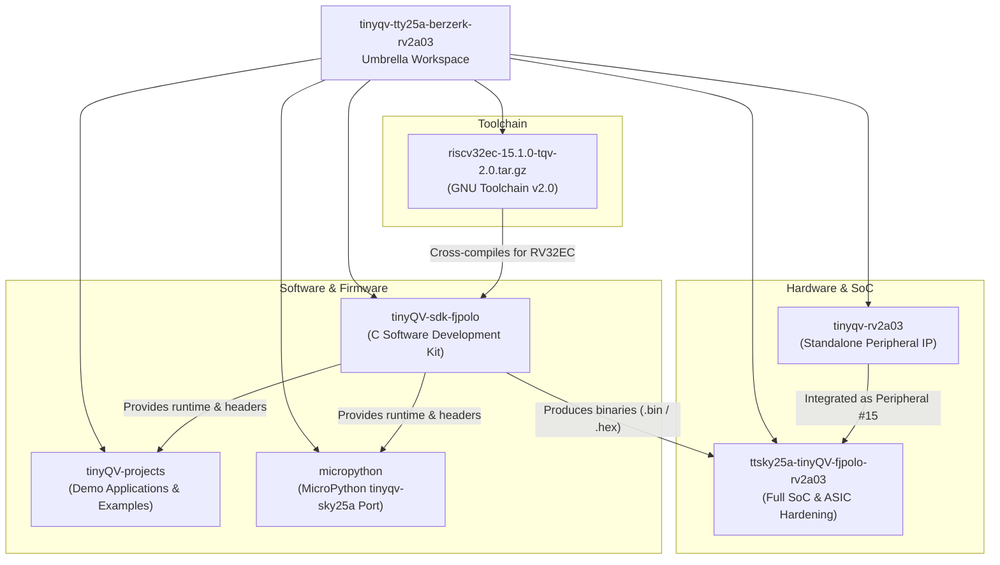

# TinyQV Sky25a Berzerk – RV2A03 Integration Workspace

Welcome to the multi-repository workspace for the **RV2A03** (Nintendo NES NTSC Ricoh 2A03 APU audio peripheral) integrated into the **TinyQV** RISC-V System-on-Chip (SoC) for the [Tiny Tapeout Sky25a shuttle](https://app.tinytapeout.com/shuttles/ttsky25a) ("Berzerk" instance).

This repository serves as an umbrella superproject coordinating the hardware peripheral IP, the full SoC ASIC integration, the C software development kit (SDK), and the pre-built RISC-V toolchain.

---

## Workspace Architecture

The workspace is organized into modular Git submodules and bundled toolchain artifacts:



---

## Submodule Distribution

| Component | Path | Upstream / Fork URL | Configured Branch | Purpose |
| :--- | :--- | :--- | :--- | :--- |
| **Full SoC Integration** | [`ttsky25a-tinyQV-fjpolo-rv2a03`](ttsky25a-tinyQV-fjpolo-rv2a03/) | [`fjpolo/ttsky25a-tinyQV-fjpolo-rv2a03`](https://github.com/fjpolo/ttsky25a-tinyQV-fjpolo-rv2a03) | `fjpolo/RV2A03` | Top-level TinyQV SoC ("Berzerk" instance) integrating the RISC-V processor, interconnect, memory bus, and all peripherals including RV2A03 (`tqvp_fjpolo_rv2a03`). Used for full-chip tapeout hardening (OpenLane) and system-level verification. |
| **RV2A03 Peripheral IP** | [`tinyqv-rv2a03`](tinyqv-rv2a03/) | [`fjpolo/tinyqv-rv2a03`](https://github.com/fjpolo/tinyqv-rv2a03) | `main` | Standalone hardware repository for the RV2A03 audio peripheral (based on `tinyqv-full-peripheral-template`). Contains synthesizable Verilog (`apu.v`), SPI interface, unit-level cocotb testbench, and register definitions. |
| **TinyQV C SDK** | [`tinyQV-sdk-fjpolo`](tinyQV-sdk-fjpolo/) | [`fjpolo/tinyQV-sdk-fjpolo`](https://github.com/fjpolo/tinyQV-sdk-fjpolo) | `main` | C SDK fork for writing firmware and bare-metal applications targeting TinyQV. Contains startup assembly (`start.s`), linker scripts, runtime libraries, and peripheral drivers (UART, SPI, Timer, GPIO, Gamepad, PRISM, VGA). |
| **Demo Projects** | [`tinyQV-projects`](tinyQV-projects/) | [`MichaelBell/tinyQV-projects`](https://github.com/MichaelBell/tinyQV-projects) | `main` | Curated collection of standalone demo applications and firmware examples for TinyQV (e.g., 3D ASCII donut, VGA graphics, LCD, cellular automata, UART echo). |
| **MicroPython Port** | [`micropython`](micropython/) | [`MichaelBell/micropython`](https://github.com/MichaelBell/micropython) | `tinyqv-sky25a` | Minimal MicroPython runtime ported for TinyQV on the Sky25a shuttle. Provides an interactive Python REPL over UART (115200 baud) and hardware access via `machine.Pin` and SPI. |
| **GNU Toolchain (v2.0)** | [`riscv32ec-15.1.0-tqv-2.0.tar.gz`](https://github.com/MichaelBell/riscv-gnu-toolchain/releases/tag/15.1.0-tqv-2.0) | [Upstream Release](https://github.com/MichaelBell/riscv-gnu-toolchain/releases/tag/15.1.0-tqv-2.0) | `15.1.0-tqv-2.0` | Pre-built custom RISC-V GNU GCC toolchain (`riscv32ec-15.1.0-tqv-2.0`) configured for GCC 15 with `rv32ec_zcb_zicond` / `ilp32e` required for TinyQV on the Sky25a shuttle. Avoids compiling GCC from source. |

---

## Getting Started

### 1. Cloning the Repository

Because this repository uses submodules (including nested submodules inside `tinyqv-rv2a03/firmware`), always clone recursively:

```bash
git clone --recurse-submodules https://github.com/fjpolo/tinyqv-tty25a-berzerk-rv2a03.git
cd tinyqv-tty25a-berzerk-rv2a03
```

If you have already cloned the repository without submodules:

```bash
git submodule update --init --recursive
```

---

### 2. Setting Up the RISC-V Toolchain

For the **Tiny Tapeout Sky25a shuttle (`ttsky25a`)**, TinyQV uses the **v2.0 toolchain** (`riscv32ec-15.1.0-tqv-2.0`), which upgrades the toolchain to GCC 15 configured for `rv32ec_zcb_zicond` with `ilp32e` ABI.

#### Download and Extract the v2.0 Toolchain (`15.1.0-tqv-2.0`)

**Option A: Extract to the default location (`/opt/tinyQV`) (Recommended)**
```bash
# 1. Download the pre-built v2.0 toolchain (x86_64 Linux):
wget https://github.com/MichaelBell/riscv-gnu-toolchain/releases/download/15.1.0-tqv-2.0/riscv32ec-15.1.0-tqv-2.0.tar.gz
# (If on ARM64 Linux / Apple Silicon WSL, use: riscv32ec-arm64-15.1.0-tqv-2.0.tar.gz)

# 2. Extract to /opt/tinyQV (clearing any older version first):
sudo mkdir -p /opt/tinyQV
sudo rm -rf /opt/tinyQV/*
sudo tar -xzf riscv32ec-15.1.0-tqv-2.0.tar.gz -C /opt/tinyQV --strip-components=1
```

**Option B: Extract to a local directory without sudo**
```bash
mkdir -p $HOME/toolchains/tinyQV
tar -xzf riscv32ec-15.1.0-tqv-2.0.tar.gz -C $HOME/toolchains/tinyQV --strip-components=1
```

#### Make Toolchain Available at Startup (Persistent PATH)

To ensure the compiler binaries are automatically accessible in every new terminal session without re-exporting manually:

- **For Bash users (`~/.bashrc`)**:
  ```bash
  echo 'export PATH=/opt/tinyQV/bin:$PATH' >> ~/.bashrc
  source ~/.bashrc
  ```

- **For Zsh users (`~/.zshrc`)**:
  ```bash
  echo 'export PATH=/opt/tinyQV/bin:$PATH' >> ~/.zshrc
  source ~/.zshrc
  ```

- **System-wide for all users (`/etc/profile.d/tinyqv.sh`)**:
  ```bash
  echo 'export PATH=/opt/tinyQV/bin:$PATH' | sudo tee /etc/profile.d/tinyqv.sh
  ```

*(Note: If you extracted to a custom local directory using Option B, adjust the path to `$HOME/toolchains/tinyQV/bin` and also persist `export RISCV_TOOLCHAIN=$HOME/toolchains/tinyQV`).*

#### Verify Installation

Verify that the toolchain is installed and accessible in your `PATH`:
```bash
riscv32-unknown-elf-gcc --version
```

---

## Submodule Usage & Workflows

### 1. Standalone RV2A03 Peripheral (`tinyqv-rv2a03`)

Use this repository to develop, modify, and verify the RV2A03 audio core in isolation.

#### Hardware Features
- **Audio Channels**: Pulse 1, Pulse 2, Triangle, and Noise channels.
- **Mixer**: Linearized output mixer producing 16-bit audio samples.
- **Modifications**: Frequency sweep unit omitted to conserve area; NTSC-tuned timings.
- **Peripheral ID**: **#15** (Index `14`).

#### Register Map Summary
| Address | Name | Access | Description |
| :--- | :--- | :--- | :--- |
| `0x00` - `0x1F` | APU Registers | R/W | Direct access to NES APU sound channels (maps to NES `0x4000` - `0x401F`). |
| `0x20` | Configuration0 | R/W | `b2`: `isMMC5` (MMC5 expansion), `b1`: `US` (ultrasound mode), `b0`: `CE` (clock enable). |
| `0x22` | Status0 | R | `b1`: APU interrupt request, `b0`: sample ready. |
| `0x23` | Data Input | R/W | Command/data write port to APU. |
| `0x24` | Data Output MSB | R | Most significant byte of the 16-bit mixed audio sample. |
| `0x25` | Data Output LSB | R | Least significant byte of the 16-bit mixed audio sample. |

#### Running Standalone Simulation (cocotb)

Run simulation inside a Python virtual environment to isolate test dependencies:

```bash
cd tinyqv-rv2a03/test
sudo apt update
sudo apt install -y iverilog gtkwave
sudo apt install -y python3-venv iverilog gtkwave
python3 -m venv .venv
source .venv/bin/activate
pip install -r requirements.txt
make -B
```

Inspect generated waveforms using GTKWave or Surfer:
```bash
gtkwave tb.vcd tb.gtkw
```

---

### 2. Firmware & Application Development (`tinyQV-sdk-fjpolo`)

The SDK provides the libraries and linker scripts to write C code for TinyQV.

#### Project Templates
- `example-project/`: Standard template for programs running on hardware with external QSPI flash.
- `example-sim-project/`: Compact template tailored for simulation runs with constrained RAM/flash.

#### Building the SDK & Applications

1. **Build the SDK runtime libraries**:
   ```bash
   cd tinyQV-sdk-fjpolo
   make
   ```
   This builds `start.o`, `tinyQV.a`, `tinyQV-sim.a`, `tinyQV-asteroids.a`, and `tinyQV-berzerk.a` (which includes the `rv2a03.o` driver).

2. **RV2A03 NES Audio Driver (`peripherals/rv2a03.h`)**:
   The SDK includes a modular C driver for the RV2A03 APU at peripheral index #14 (`0x8000380`):
   - `rv2a03_regs.h`: Register memory map (`RV2A03_SQ1_VOL`, `RV2A03_TRI_LINEAR`, `RV2A03_SND_CHN`, etc.).
   - `rv2a03_init()`: Configures peripheral enable, clock divider, and clears sound channels.
   - `rv2a03_play_square()`, `rv2a03_play_triangle()`, `rv2a03_play_noise()`: High-level channel note playback.
   - `rv2a03_read_sample()`: Reads 16-bit mixed audio sample from hardware ports (`0x24` / `0x25`).

3. **Build an Application**:
   ```bash
   cd example-project
   make
   ```
   *(Or `cd example-sim-project && make` for simulation firmware).*

This generates `.elf`, `.bin`, and `.hex` binaries compatible with TinyQV and the [TinyQV Web Programmer](https://program.tinyqv.com).

---

### 3. Full SoC ASIC Integration (`ttsky25a-tinyQV-fjpolo-rv2a03`)

This submodule integrates the complete SoC design for the Tiny Tapeout Sky25a shuttle.

#### Key Files
- `src/peripherals.v`: Peripheral interconnect wiring, instantiating `tqvp_fjpolo_rv2a03` at peripheral index 14/15.
- `src/user_peripherals/RV2A03/`: Verilog sources for the RV2A03 peripheral within the SoC tree.
- `docs/user_peripherals/15_RV2A03.md`: Integration datasheet for the shuttle submission.

#### Running Full SoC cocotb Simulation

Run simulation inside a Python virtual environment:

```bash
cd ttsky25a-tinyQV-fjpolo-rv2a03/test
python3 -m venv .venv
source .venv/bin/activate
pip install -r requirements.txt
make -B
```

#### ASIC Hardening via OpenLane
To run the automated synthesis and physical layout flow:
```bash
cd ttsky25a-tinyQV-fjpolo-rv2a03
./run_flow.sh
```

---

### 4. Demo Applications & Showcase (`tinyQV-projects`)

This submodule provides a suite of sample applications demonstrating various TinyQV features, peripherals, and graphics.

#### Key Examples
- `rv2a03_test/`: **RV2A03 Hardware Verification & Chiptune Demo**. Directly translates the 5 cocotb tests (`test_sq1_channel`, `test_sq2_channel`, `test_tri_channel`, `test_noise_channel`, and `test_all_channels_together`) into self-checking C code reporting test pass/fail over UART, validates sample generation and readback, and plays an authentic NES chiptune melody!
- `donut/`: Animated ASCII 3D donut rendered over UART.
- `vga_gfx/` & `vga_console/`: Hardware-accelerated graphics and text console demos using the PRISM/VGA peripheral.
- `cellular/`: Conway's Game of Life cellular automaton.
- `ledstrip/`: WS2812B NeoPixel LED strip controller.
- `hello/`: Minimal UART "Hello, World!" example.

#### Building a Project (e.g., `rv2a03_test` or `donut`)
Make sure the SDK runtime libraries are compiled first (`make` in `tinyQV-sdk-fjpolo`), then build:

```bash
cd tinyQV-projects/rv2a03_test
make
```

Or for `donut`:
```bash
cd tinyQV-projects/donut
make TINYQV_SDK=../../tinyQV-sdk-fjpolo
```

This generates `.elf`, `.bin`, and `.hex` binaries ready to upload with the [TinyQV Web Programmer](https://program.tinyqv.com).

---

### 5. MicroPython Runtime Port (`micropython`)

The `micropython` submodule contains a customized MicroPython port targeting TinyQV on Sky25a, providing an interactive Python REPL over UART and hardware control through the `machine` module.

#### Building MicroPython

1. **Build the host cross-compiler (`mpy-cross`)**:
   ```bash
   cd micropython
   make -C mpy-cross
   ```

2. **Build the TinyQV port firmware**:
   ```bash
   cd ports/tinyQV
   make submodules
   make TINYQV_SDK=../../../tinyQV-sdk-fjpolo
   ```

This generates `build/firmware.bin` suitable for flashing to external QSPI memory. When TinyQV boots with this firmware, connect to UART at **115200 baud** to access the MicroPython prompt (`>>>`):

```python
import machine
# Control GPIO pins (outputs 0-7, inputs 8-15)
pin = machine.Pin(1, machine.Pin.OUT)
pin.value(1)
```

---

## Submodule Maintenance & Best Practices

### Updating Submodules to Remote Tracking Branches
To pull the latest commits for each submodule according to `.gitmodules`:
```bash
git submodule update --remote --merge
```

### Making Changes Inside a Submodule
Because submodules point to specific commit hashes (detached `HEAD` by default), follow this workflow when making modifications:

1. Navigate into the submodule directory:
   ```bash
   cd tinyqv-rv2a03
   ```
2. Checkout or create the appropriate working branch:
   ```bash
   git checkout main   # or your active dev branch
   ```
3. Commit and push changes to the submodule's remote:
   ```bash
   git commit -am "Update audio mixer"
   git push origin main
   ```
4. Return to the root repository and record the new submodule commit pointer:
   ```bash
   cd ..
   git add tinyqv-rv2a03
   git commit -m "Update tinyqv-rv2a03 submodule reference"
   git push origin master
   ```

---

## Useful References & Links

- [Tiny Tapeout Documentation](https://tinytapeout.com)
- [Tiny Tapeout Sky25a Shuttle](https://app.tinytapeout.com/shuttles/ttsky25a)
- [TinyQV Architecture (Michael Bell)](https://github.com/MichaelBell/tinyQV)
- [TinyQV Web Programmer](https://program.tinyqv.com)
- [NESdev Wiki: 2A03 APU](https://www.nesdev.org/wiki/APU)
