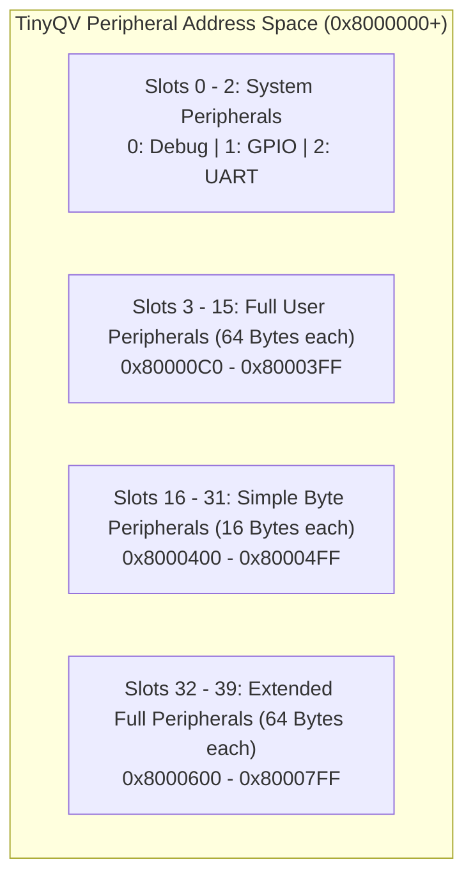

# 02. Peripherals & Slot Allocation

## 1. The TinyQV Modular Peripheral Concept

On standard microcontrollers, peripherals (UART, SPI, timers, audio) are fixed by the silicon vendor. In contrast, **TinyQV** is a community-driven collaborative ASIC architecture where developers worldwide contribute hardware accelerators and I/O controllers that plug into a standardized on-chip bus.

Every peripheral is assigned:
1. A **Slot Index** (`PERI_IDX`) determining its address range in the memory map.
2. A **Dedicated Memory Window** (64 bytes or 16 bytes).
3. Configurable routing to external PMOD I/O pins via **Pin Function Multiplexers (`FUNC_SEL`)**.
4. An optional dedicated **User Interrupt Line** wired directly to the CPU core.

---

## 2. Peripheral Slot Classification & Memory Allocation

TinyQV partitions the `0x8000000` memory-mapped I/O range into three distinct peripheral classes:



### 2.1 Full User Peripherals (Slots 3–15)
* **Window Size**: **64 bytes** (addresses `0x00` through `0x3F` relative to peripheral base).
* **Address Formula**:
  $$\text{Base Address} = \text{0x8000000} + (\text{0x40} \times \text{PERI\_IDX})$$
* **Slot 14 Assignment**:
  * **Peripheral Index**: `14` (`0x0E`)
  * **Base Address**: $\text{0x8000000} + (0x40 \times 14) = \mathbf{\text{0x8000380}}$
  * **IP Core**: `tqvp_fjpolo_rv2a03` (Berzerk RV2A03 NES APU Sound Peripheral)

### 2.2 Simple Byte Peripherals (Slots 16–31)
* **Window Size**: **16 bytes** (addresses `0x00` through `0x0F`).
* **Address Formula**:
  $$\text{Base Address} = \text{0x8000300} + (\text{0x10} \times \text{PERI\_IDX})$$
* Ideal for compact control blocks like PWM generators, rotary encoder counters, LED strip drivers, and simple SPI masters.

### 2.3 Extended Full Peripherals (Slots 32–39)
* **Window Size**: **64 bytes** (addresses `0x00` through `0x3F`).
* **Address Formula**:
  $$\text{Base Address} = \text{0x8000600} + (\text{0x40} \times (\text{PERI\_IDX} - 32))$$
* Reserved for large mathematical accelerators, FPU units, CORDIC engines, and sound synthesizers.

### 2.4 Complete Silicon Peripheral Allocation Table

| Slot # | Type | Author | Peripheral Name | Base Address |
| :---: | :---: | :--- | :--- | :--- |
| **0** | System | Mike Bell | System Debug & Chip ID | `0x8000000` |
| **1** | System | Mike Bell | GPIO & Pin Function Select | `0x8000040` |
| **2** | System | Mike Bell | Hardware UART (115200 8N1) | `0x8000080` |
| **3** | Full | Mike Bell | Gamepad PMOD Interface | `0x80000C0` |
| **4** | Full | Sohaib Errabii | Neural Processing Unit (NPU) | `0x8000100` |
| **5** | Full | htfab | Baby VGA | `0x8000140` |
| **6** | Full | Niklas Anderson | Watchdog Timer (WDT) | `0x8000180` |
| **7** | Full | Jesus Arias | CAN Bus Controller | `0x80001C0` |
| **8** | Full | Ken Pettit | PRISM Core | `0x8000200` |
| **9** | Full | Mike Bell | VGA Graphics Controller | `0x8000240` |
| **10** | Full | Jon Nordby | PDM Audio Decoder | `0x8000280` |
| **11** | Full | Han | Pulse Transmitter | `0x80002C0` |
| **12** | Full | Maciej Lewandowski | Tiny CORDIC Math Unit | `0x8000300` |
| **13** | Full | Ciro Cattuto | VGA Character Console | `0x8000340` |
| **14** | **Full** | **@fjpolo** | **RV2A03 NES APU Sound Peripheral** | **`0x8000380`** |
| **15** | Full | Pranav | TinyTone PWM Audio | `0x80003C0` |
| **16** | Simple | Matt Venn | Rotary Quadrature Encoder | `0x8000400` |
| **17** | Simple | Uri Shaked | Edge Counter | `0x8000410` |
| **18** | Simple | Ciro Cattuto | WS2812B LED Strip Driver | `0x8000420` |
| **20** | Simple | Sujith Kani A. | Hardware PWM Generator | `0x8000440` |
| **32** | Ext | Diego Satizanal | Half-Precision FPU | `0x8000600` |
| **33** | Ext | Toivo Henningsson | Piecewise Linear (PWL) Synth | `0x8000640` |

---

## 3. Physical I/O & Pin Multiplexing

The Tiny Tapeout chip package provides an **8-pin Input PMOD (`ui_in`)** and an **8-pin Output PMOD (`uo_out`)**:

```
+-------------------------------------------------------------+
|                     TinyQV I/O System                       |
|                                                             |
|  [ui_in 0..7]  ----(2-FF Sync)----> Shared by ALL Periphs   |
|                                                             |
|  [uo_out 0..7] <---[FUNC_SEL MUX]-- Selected Peripheral     |
+-------------------------------------------------------------+
```

### 3.1 Input PMOD (`ui_in[7:0]`)
* Broadcast simultaneously to **all peripherals**.
* Inputs pass through a **2-stage flip-flop synchronizer** to eliminate metastability (introducing a 2-cycle latency).
* By convention:
  * `ui_in[7]` is the default UART RX pin.
  * `ui_in[3]` can be selected as alternate UART RX via register `0x800008C`.

### 3.2 Output PMOD & `FUNC_SEL` Routing (`0x8000060` - `0x800007F`)
Because multiple peripherals cannot drive the output pins simultaneously, TinyQV implements dynamic multiplexing. Each output pin `uo_out[N]` has an independent 32-bit register `FUNC_SEL[N]` at `0x8000060 + (4 * N)`:

| `FUNC_SEL` Value | Routed Source to `uo_out[N]` |
| :---: | :--- |
| **0** | Output Disabled (High-Impedance / Low) |
| **1** | GPIO Peripheral (Controlled directly by `0x8000040`) |
| **2** | UART TX / Control |
| **3 – 15** | Full User Peripheral 3 – 15 (**14 = RV2A03 APU**) |
| **16 – 31** | Simple Byte Peripheral 0 – 15 |
| **32 – 39** | Extended User Peripheral 16 – 23 |

### 3.3 Output Debug Override Registers
At power-on reset, bits 6 and 7 of `uo_out` default to internal hardware debug tracing. Firmware must unlock them before peripherals can drive them:
```c
#include "gpio.h"

// Disables register debug tracing and enables normal peripheral output on all 8 pins:
enable_all_outputs();
```

### 3.4 Audio Multiplexer: `AUDIO_FUNC_SEL` (`0x8000050`)
To allow audio peripherals to feed directly into the onboard analog filter or headphone pin without remapping the entire 8-bit bus, register `0x8000050` routes designated audio outputs directly to `uo_out[7]`:
* `0–7`: PSRAM Bank B enabled (normal digital bus).
* `8`: PWL Synth (Slot 33, out 7).
* `10`: PWM (Slot 20, out 0).
* `12`: PRISM (Slot 8, out 7).
* `15`: TinyTone (Slot 15, out 7).

---

## 4. Hardware Peripheral Interface Port Standard

Every peripheral module in TinyQV adheres to the canonical Verilog interface:

```verilog
module tqvp_<author>_<name> (
    input  wire        clk,           // System clock (64 MHz ASIC, 27 MHz FPGA)
    input  wire        rst_n,         // Active-low synchronous reset

    input  wire [7:0]  ui_in,         // Synchronized 8-bit input PMOD
    output wire [7:0]  uo_out,        // 8-bit output PMOD (active when selected)

    input  wire [5:0]  address,       // Relative register offset within slot (0-63)
    input  wire [31:0] data_in,       // Write data from CPU
    input  wire [1:0]  data_write_n,  // Active-low write strobe & width selector
    input  wire [1:0]  data_read_n,   // Active-low read strobe & width selector

    output wire [31:0] data_out,      // Read data back to CPU
    output wire        data_ready,    // Wait-state / completion flow control
    output wire        user_interrupt // Dedicated interrupt request line to CPU
);
```
