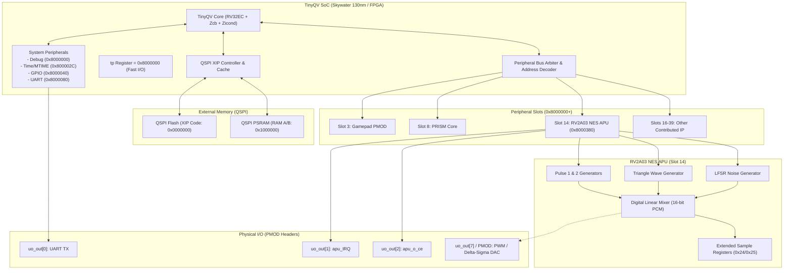

# TinyQV & RV2A03 Sound Peripheral Documentation

Welcome to the technical architecture and reference documentation for the **TinyQV RISC-V SoC** and the **RV2A03 NES APU Sound Peripheral** on the **Tiny Tapeout Sky25a** shuttle and Gowin FPGAs.

---

## Documentation Index

This directory provides deep-dive architectural specifications, bus protocol references, hardware registers, and comparative analyses:

| Chapter | Document | Topics Covered |
| :--- | :--- | :--- |
| **01** | [**TinyQV SoC Architecture**](01_tinyqv_architecture.md) | RISC-V `rv32ec_zcb_zicond` core, 28-bit/24-bit addressing, hardcoded pointers (`gp`, `tp`), XIP QSPI Flash cache, PSRAM memory layout, system registers (`DEBUG`, `TIME`, `GPIO`, `UART`). |
| **02** | [**Peripherals & Slot Allocation**](02_peripherals_and_slots.md) | Peripheral slot organization (Full, Simple, Extended), GPIO multiplexing (`FUNC_SEL`), pinout configurations (`ui_in`, `uo_out`), `AUDIO_FUNC_SEL`, and system integration. |
| **03** | [**Peripheral Bus Protocol & Timing**](03_peripheral_bus_protocol.md) | Synchronous bus interface, address decoding (`0x8000000`), byte/halfword/word enables (`data_write_n`, `data_read_n`), `data_ready` handshake, bus cycle waveforms, and wait-state handling. |
| **04** | [**Nintendo NES APU Architecture**](04_nes_apu_architecture.md) | Original Ricoh 2A03/2A07 sound chip, Pulse 1 & 2 channels, Triangle channel, LFSR Noise generator, DMC (DPCM) channel, Frame Counter sequencer (4-step/5-step), and non-linear analog mixer. |
| **05** | [**RV2A03 Peripheral & Differences vs Real APU**](05_rv2a03_peripheral.md) | Silicon implementation (Slot 14), register map (`0x00`-`0x25`), digital mixer, direct 16-bit PCM readout, silicon errata (DC leak & gating quirks), and comprehensive differences/limitations vs the original Ricoh 2A03. |

---

## System Architecture High-Level Block Diagram

---

## Quick Navigation

* To understand how the CPU boots and accesses memory: **[Chapter 01: TinyQV SoC Architecture](01_tinyqv_architecture.md)**
* To learn how to build or connect a new peripheral: **[Chapter 02: Peripherals & Slots](02_peripherals_and_slots.md)** & **[Chapter 03: Bus Protocol](03_peripheral_bus_protocol.md)**
* To understand classical NES chiptune synthesis: **[Chapter 04: Nintendo NES APU Architecture](04_nes_apu_architecture.md)**
* To program, debug, or inspect our silicon chip: **[Chapter 05: RV2A03 Peripheral & Comparison](05_rv2a03_peripheral.md)**
* **Silicon Visualization**:
  - 🖼️ [2D ASIC GDSII Layout Render](https://camo.githubusercontent.com/cac6e18a82b61a7fb0bae33d039d30e6a5a63dab5986ba3d7df82a8f59b8f89e/68747470733a2f2f666a706f6c6f2e6769746875622e696f2f74696e7971762d7276326130332f6764735f72656e6465722e706e67)
  - 🌐 [Interactive 3D GDS WebGL Viewer](https://fjpolo.github.io/tinyqv-rv2a03/)
